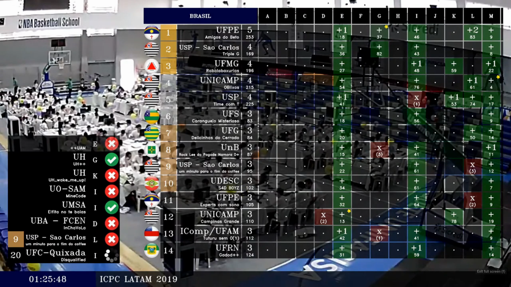
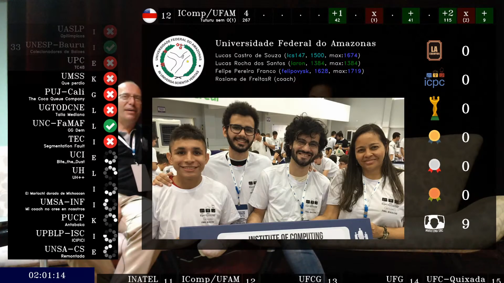

# Scoreboard for live streaming using BOCA



This code was used in the Brazilian Finals 2019. The results can be seen in any of the following links:

- [YouTube](https://www.youtube.com/watch?v=qihNV2GGXig)
- [Facebook](https://www.facebook.com/maratona/videos/961219877568283/)

Streaming was carried out using [OBS Studio](https://obsproject.com/) to boradcast the scoreboard window. The straming was broadcasted to YouTbe, Facebook and Twitch via [Restream](https://restream.io/). Scoreboard information is automatically obtained from [BOCA](https://www.ime.usp.br/~cassio/boca/).

## Compiling and running

Install prerequisites:

```
$ sudo apt install libopencv-dev
```

Download this repository:

```
$ git clone https://github.com/maups/maratona-live
```

Compile & run:

```
$ cd maratona-live/live
$ ./compile.sh
$ ./live
```

For now, the code must be executed inside the *'maratona-live/live/'* directory, as it uses relative paths to access auxiliary files (*'maratona-live/config/'*, *'maratona-live/assets/'*).

How to configure it for your own contest:

- The file *'maratona-live/live/get_webcast.sh'* automatically downloads the list of submissions from BOCA. Make sure you update it with the information from your own BOCA server.

- The file *'maratona-live/config/cameras.txt'* specifies the video streams in your computer. You can either use webcams (e.g. *'/dev/video0'*) or RTSP streams (e.g. *'rtsp://192.168.0.1:5000/screen'*).

- The file *'maratona-live/config/contest.txt'* specifies the competition start time.

- The file *'maratona-live/config/attributes.txt'* specifies team attributes for all teams. The first attribute must always be *'username'* and the values must match the team usernames on BOCA. Use the value 'none' when a team does not have a value for an attribute, but all teams must have a valid username.

- The file *'maratona-live/config/gui.txt'* specifies which attributes are going to be used as the source of icons and which attributes are going to be used for filtered scoreboards. For each attribute used as a source of icons, create a folder on *'maratona-live/assets/'* with the attribute name and create one png file per attribute value. For each filtered scoreboard, pick on attribute and the attribute value and specify the number of gold, silver and bronze medals for that specific screboard.

Check the files in this repository to get a better idea of their format.

## Create team stats for featured teams



To use team stats, the file *'maratona-live/config/attributes.txt'* has to have a column named *'featured'* with value *'yes'* for teams with stats and *'no'* for other teams. Then compile & run:

```
$ cd maratona-live/stats
$ ./compile.sh
$ ./stats
```

When you use this functionality for your own contest, make sure you update the file *'maratona-live/stats/team_info.txt'* to include the correct information of the participating teams (e.g. BOCA username, team name, contestants, codeforces handles, coach, etc).
